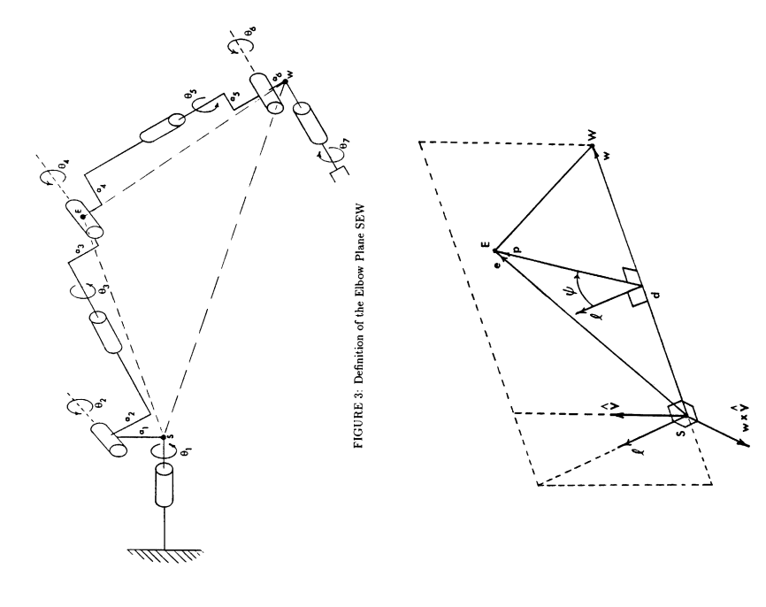
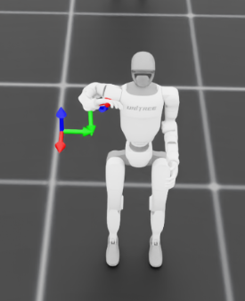
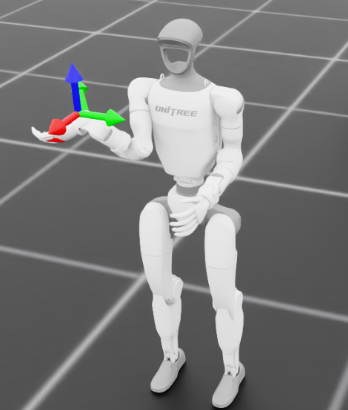

# posefork

Multi-mode reaching for the Unitree G1 right arm, trained in Isaac Lab. The
goal is not just *to reach a target*, but to learn a single policy that reaches
the **same** target in **several distinct postures** — so the resulting
rollouts can be used as a synthetic, behaviorally-diverse dataset for
downstream imitation learning.

> **The honest motivation.** I'm a solo dev with no demo-collection budget.
> Unitree ships [`unitree_rl_lab`](https://github.com/unitreerobotics/unitree_rl_lab)
> for locomotion RL, but there's no official IL/manipulation pipeline to learn
> from — and almost every manipulation method out there assumes you already have
> human demonstration data (teleop rigs, mocap, VR). So where is a broke
> developer supposed to build the skill? Fine. I'll make my own data.
>
> **The bet:** can **massively parallel RL** (4096 envs) manufacture the
> *behavioral diversity* those expensive datasets provide — without collecting a
> single human demo?

---
> ⚠️ **Work in progress.** This is active research, not a finished method — expect rough edges, half-built pieces, and things that will change. But the core thing works: **the postures actually fork.** A single policy holds multiple distinct arm-angle modes without collapsing into one. That part is real. Everything around it is still being built.
> 
## The distinction this whole thing rests on

Parallel RL hands you two very different things, and conflating them is the trap:

- **Coverage diversity** — variety in *targets* and *initial states*. 4096 envs
  give this for free.
- **Style diversity** — variety in *how the same goal is solved* (different arm
  postures, different approach paths). This does **not** come for free. It needs
  an explicit mechanism, and building that mechanism is what this repo is about.

`posefork` tries to manufacture *style diversity* on a redundant 7-DOF arm,
where a single Cartesian target admits a whole continuum of joint
configurations (the classic redundancy / null-space of a manipulator).

---

## Approach — and the cheap trick at the heart of it

The arm has 7 DOF, but position-only reaching imposes just 3 constraints,
leaving a redundant manifold of valid postures. The problem: how do you tell a
policy *which* posture to pick, cheaply, across 4096 environments running on a
single GPU?

The expensive answer is to run an IK solver per environment every step. I tried
that (`EpisodeStartIKTeacher` in `teachers.py`) — it's heavy and unstable, and a
broke-dev GPU does not love 4096 IK solves in the hot loop.

The cheap answer is older than I am. Aerospace / redundant-manipulator robotics
solved "where on the redundant manifold does the elbow sit" decades ago with the
**swivel angle** (the **arm-angle**, in the Shoulder-Elbow-Wrist / SEW family):
a *single scalar* describing how far the elbow is rotated about a reference axis.
It's computed in **closed form** from a few joint positions — no solver, no
iteration, just geometry. So I pulled that idea out of the redundancy literature
and repurposed it as a **diversity coordinate**.

The exact form used here (`_compute_arm_angle` in `mdp/rewards.py`) is a variant
adapted to this reward setup. The reference axis is **shoulder → target** (not
shoulder → wrist — the wrist is deliberately left out of this term), and the
zero-reference is gravity, so a neutral hanging elbow sits near 0 rad:

```
sw      = target - shoulder                      # reference axis (shoulder → EE target)
sw_unit = sw / |sw|
se_perp = (elbow - shoulder)  projected ⟂ to sw_unit     # elbow offset in the plane ⟂ to the axis
ref     = (-Z) projected ⟂ to sw_unit                    # gravity, projected into the same plane
φ       = atan2( (ref × se_perp) · sw_unit ,  ref · se_perp )
```

So the three points are **Shoulder, Elbow, Target** — the "W" slot of the
classic SEW formula is filled by the *target*, not the wrist. (This is also the
code-level reason the wrist drifts: it simply doesn't enter this reward.) The
angle is wrapped circularly when compared against the per-mode target `phi_k`.



With that scalar in hand:

- Each environment gets a permanent discrete `mode_id` (one-hot, fed to the
  policy as an observation).
- A per-mode reward term nudges the policy to reach the target *and* keep its
  arm-angle near a mode-specific value `phi_k`, gated so it only kicks in once
  the hand is close to the target (`gate = exp(-ee_dist / 0.3)`).
- Because the arm-angle is analytic, the entire diversity signal is **batched on
  the GPU** alongside everything else. No per-env IK in the loop. This is the
  whole reason it runs on hardware I can actually afford.

To stop the modes from collapsing onto one solution under PPO, the learner is
customized. **`ModePPO` subclasses rsl_rl's `PPO`** — same trust-region core,
two changes:

- **Per-mode advantage normalization.** Advantages are normalized *within each
  mode* rather than globally, so a mode with a weak/quiet learning signal isn't
  flattened by the dominant modes. A floor (`ADV_STD_FLOOR = 0.02`) guards the
  division. (Caveat, learned the hard way: this floor is a one-sided guard — it
  stops the std collapsing to 0, but doesn't cap the other direction, so in a
  very weak-signal regime it can over-amplify)
- **Worst-mode aggregation.** The surrogate loss is a blend of the mean over
  modes and the worst mode: `(1 - α)·mean + α·worst`, with
  `WORST_MODE_ALPHA = 0.3`. This keeps the hardest mode from being abandoned.

Paired with **`ModeConditionedActorCritic`** (per-mode policy/value heads).
Stability in practice also needed `desired_kl = 0.02` and `max_grad_norm = 0.3`.

Full design rationale, implementation notes, and the known asymmetry in
`ADV_STD_FLOOR`: [modeppo_design.md](modeppo_design.md).

Waist joints are locked at startup (joint-limit lock via a startup event) to
keep torso motion from leaking into the reaching solution.

---

## Status — what works, what doesn't (yet)

Active research repo. Straight talk, no hedging:

**Working:**
- A single policy holds **three posture modes** without collapse; measured
  arm-angle spread across modes is solidly non-trivial.
- The arm-angle teacher is **analytic and GPU-batched** — the cheap-compute thesis
  holds in practice, not just on paper.

**Not there yet (and on my list to fix, roughly within a month):**
- The mode targets `phi_k` are currently **prescribed** (set by hand), not
  *emergent*. The stronger version of the thesis — diversity the policy
  *discovers* on its own — isn't built yet.
- **Wrist DOFs** are barely constrained by the current rewards (orientation
  target is fixed; the arm-angle term doesn't pin the wrist), so the wrist drifts to
  its joint limits. Known root cause, fix is scoped.
- Motion is **end-pose diverse but path-bland**: the diversity signal sits on
  the *final posture*, not the trajectory, so approach paths look similar across
  modes. Making the *path* diverse (e.g. a phase-dependent arm-angle target) is
  the next step — and notably it does **not** need a heavy trajectory model.


| Mode 0 | Mode 1 |
|:---:|:---:|
|  |  |

---

## Repository layout

```
posefork/
├── posefork/
│   ├── algorithms/
│   │   └── mode_ppo.py                 # per-mode advantage norm + worst-mode aggregation
│   └── tasks/g1_arm_reach/
│       ├── env_cfg.py                  # 4096-env multi-mode reach config
│       ├── env_cfg_single.py           # single-mode learnability baselines (SingleA / SingleB)
│       ├── agents/
│       │   ├── mode_actor_critic.py    # per-mode policy/value heads
│       │   └── ppo_cfg.py              # rsl_rl runner configs
│       └── mdp/
│           ├── rewards.py              # reach + per-mode arm-angle teacher (SEW)
│           ├── observations.py         # mode_id one-hot, etc.
│           └── events.py               # waist joint locking
├── scripts/                            # probes & visualization (diversity, null-space, etc.)
└── unitree_rl_lab_overrides/           # minimal hooks into unitree_rl_lab
```

Standalone Isaac Lab task package: it registers its gym envs on import and
borrows only the G1 asset from `unitree_rl_lab`.

Registered environments:

| Env ID | Purpose |
| --- | --- |
| `YB-G1-ArmReach-v0` | main multi-mode reach (4096 envs) |
| `YB-G1-ArmReach-Play-v0` | playback / visualization (few envs) |
| `YB-G1-ArmReach-ModeHead-v0` | multi-mode reach with per-mode heads |
| `YB-G1-ArmReach-SingleA-v0` / `SingleB-v0` | single-mode learnability baselines |

---

## Requirements

- [Isaac Lab](https://isaac-sim.github.io/IsaacLab/) (and Isaac Sim) — install
  this first, following their instructions.
- [`unitree_rl_lab`](https://github.com/unitreerobotics/unitree_rl_lab) — this
  project runs on top of it and uses it for the Unitree G1 robot asset.
- `rsl_rl` (the PPO trainer Isaac Lab integrates with).

Exact versions depend on your Isaac Lab install; this repo doesn't pin them.

---

## Installation

```bash
# inside your Isaac Lab python environment
git clone https://github.com/<your-id>/posefork.git
cd posefork
pip install -e .
```

Then make `unitree_rl_lab` aware of the task package by importing it where it
discovers tasks:

```python
import posefork.tasks  # registers YB-G1-ArmReach-* gym envs
```

(Hooks for this are under `unitree_rl_lab_overrides/`.)

---

## Usage

Train the main multi-mode policy:

```bash
python scripts/rsl_rl/train.py --task YB-G1-ArmReach-v0 --num_envs 4096 --headless
```

Visualize a trained policy:

```bash
python scripts/rsl_rl/play.py --task YB-G1-ArmReach-Play-v0 --num_envs 4
```

Diagnostic probes (posture diversity / null-space freedom):

```bash
python scripts/probe_teacher_diversity.py
python scripts/measure_nullspace_phi_range.py
```

---

## Where this sits relative to other work

Recent humanoid-control work combines generative priors with RL (e.g.
diffusion-guided control on the G1). The difference here is the **direction of
supervision**: those methods generate reference motion from a prior trained on
human motion data, then have RL track it. This repo has **no human-motion prior
anywhere** — diversity comes from physics, an analytic redundancy coordinate,
and the RL objective itself.

That's a harder road (natural-looking posture is genuinely tougher without a
human prior), and I'm not claiming purity automatically wins. But it's a road a
solo dev with no data budget can actually walk, and that's the point.

---

## References

The arm-angle / swivel-angle idea is borrowed from the redundant-manipulator
and aerospace robotics literature. The references I actually leaned on:

- A. J. Elias and J. T. Wen, *Redundancy parameterization and inverse kinematics
  of 7-DOF revolute manipulators* — the generalized Shoulder-Elbow-Wrist (SEW)
  angle. [arXiv:2307.13122](https://arxiv.org/abs/2307.13122) (also on NASA NTRS).
  The SEW angle is the rotation of the elbow about the shoulder-wrist line, long
  used in space teleoperation because it's intuitive for operators — which is
  exactly why it makes a cheap, human-legible diversity coordinate.
- NASA self-motion / arm-angle technical report:
  [ntrs.nasa.gov/…/19900019687](https://ntrs.nasa.gov/citations/19900019687)
